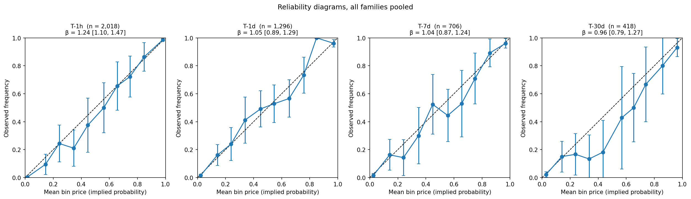
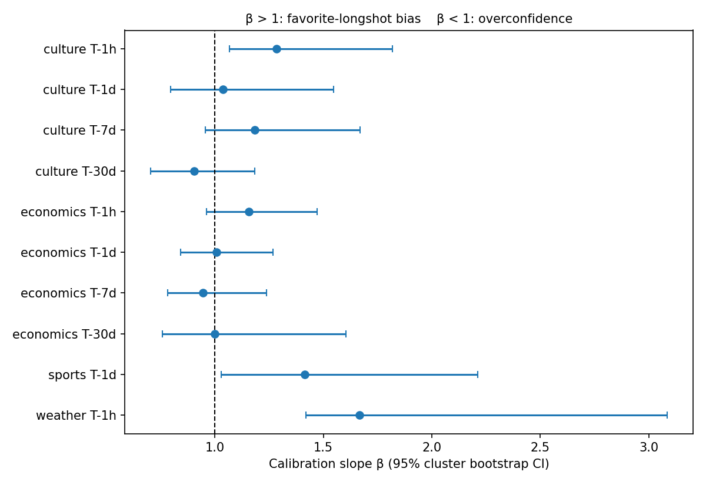

# Are prediction markets well calibrated? Evidence from Kalshi

When a Kalshi contract trades at 70 cents, does the event happen 70% of the time?
This project measures where, when and why Kalshi prices deviate from realized
frequencies, and whether those deviations survive the spread and fees.

**12,970 price observations in 1,979 events**, drawn from 184,383 settled markets
across sports, economics, weather, culture and politics. Full report:
[`WRITEUP.md`](WRITEUP.md). One-page summary: [`ONE_PAGER.md`](ONE_PAGER.md).

We exclude Polymarket due to French regulation.

## Key findings

**1. One day before resolution, prices are well calibrated.** The calibration
slope is 1.07 [0.98, 1.18] (perfect calibration is 1), and every robustness
variant agrees.



| Horizon | Observations | Events | Calibration slope β [95% CI] |
| --- | --- | --- | --- |
| 1 hour | 6,935 | 1,596 | 1.29 [1.21, 1.39] |
| 1 day | 3,803 | 978 | 1.07 [0.98, 1.18] |
| 7 days | 1,591 | 370 | 1.08 [0.97, 1.22] |
| 30 days | 641 | 156 | 1.07 [0.92, 1.30] |

**2. Near resolution, a favorite-longshot bias appears, but only in the tails.**
Kalshi prices cannot go below 1 cent, and the 3,954 contracts quoted there won
once. The bias fades as prices move away from 0 and 1:

| Prices kept, 1 hour before close | β [95% CI] |
| --- | --- |
| All | 1.29 [1.21, 1.39] |
| 0.02 to 0.98 | 1.19 [1.09, 1.30] |
| 0.05 to 0.95 | 1.13 [1.01, 1.29] |
| 0.10 to 0.90 | 1.05 [0.91, 1.21] |

**3. A small-sample false positive, caught by the protocol.** A first run with
70 sports events suggested a bias (β = 1.41). With 368 events it vanished
(β = 1.06 [0.88, 1.30]).



**4. A surprise on liquidity.** The most liquid markets, not the thinnest, show a
longshot bias one day out: β = 1.54 [1.19, 2.22] above 500,000 contracts traded,
against 0.97 to 1.05 below. It holds within economics, so it is not a sports
effect. Exploratory (96 events), to be confirmed out of sample.

**5. Nothing is exploitable by a trader who takes liquidity.**

- Backing sports favorites loses 0.42 cents per contract at the midpoint and 2.38 cents after the spread and taker fees.
- The 1-cent floor is overpriced, but only 1 of 3,954 floor quotes had a buyer to sell to: the cent goes to market makers who post offers there.

**Takeaway.** Kalshi is well calibrated away from the extremes. The visible
biases sit in the tails near resolution, where the tick size binds, and the rent
there goes to liquidity providers.

## Method

- **Fixed-date markets only** (games, data releases, elections, daily weather). Markets that can resolve early ("X before December 31") would create look-ahead bias. A data check confirms that closing times do not depend on outcomes, and caught two mislabelled series.
- **Prices frozen** 1 hour, 1 day, 7 days and 30 days before close: bid-ask midpoint, or last trade when the spread is wide.
- **Metrics:** reliability diagrams, Brier score with its Murphy decomposition, and the calibration regression logit P(o = 1) = α + β logit(p). β > 1 means longshots are overpriced.
- **Inference:** confidence intervals from a bootstrap that resamples whole events, since markets of the same event are correlated.
- **Discipline:** hypotheses and robustness checks fixed in a protocol before looking at the data; every tool validated on simulated markets with a known truth.

## Repository structure

```
scripts/
    collect_data.py         collects markets and prices at each horizon (resumable)
src/pmcal/
    calibration.py          calibration metrics and cluster bootstrap
    collect.py              market filters, label check, price extraction
    kalshi.py               read-only client for the public Kalshi API, with disk cache
    report.py               shared helpers: statistics with cluster-bootstrap CIs
notebooks/
    00_simulation_demo      validates the toolkit on simulated data with a known truth
    01_series_universe      selects the series and labels them fixed-date / deadline / multi-stage
    02_collected_data       describes the collected sample
    03_global_calibration   reliability, Murphy decomposition, calibration slope by horizon and family
    04_bias_analysis        favorite-longshot bias, tick-size artifact, cost of capital, liquidity, robustness
    05_exploitability       two pre-specified strategies with realistic execution and Kalshi fees
data/
    series_universe.csv     the labelled series, part of the protocol
    observations.parquet    one row per market and horizon (output of the script)
    results_*.csv           result tables used in the report
figures/
tests/
```

## How to run

```bash
pip install -r requirements.txt
python tests/test_calibration.py

# collect the data (resumable: rerun the same command if interrupted)
python scripts/collect_data.py --events-per-series 50   # about 10 minutes on a fast connection
python scripts/collect_data.py --all                    # full study, one to two hours

jupyter notebook notebooks/
```

No API key is needed: Kalshi market data is public. API responses are cached in
`data/raw/cache/`, which is not committed.
